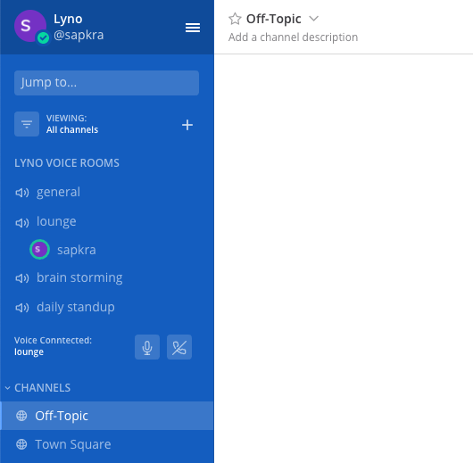

# Lyno Plugin for Mattermost

This plugin provides a direct integration of voice channels into Mattermost.
This is made possible by [lyno.io](https://lyno.io) which is using Jitsi as the base.

## Features

- Automatic authentication
- Always see all users which are currently in which rooms, even if you are not in the same room
- Mute audio
- Show who is speaking
- Play a sound when someone joins or leaves a room

## Future features
- Popup to create new channel (Interactive Dialog)
- Channel list with local user data
- Screen sharing + cams
- Plugin Settings
- Channel Header Button to create voice channels based on existing text channel

## How to use

This plugin currently has to be installed via a plugin upload. You can download the latest release [here](https://github.com/lynoapp/mattermost-plugin-lyno/releases).

After installing, the plugin UI should automatically appear above the channel list.

Requirements:
- The `SiteURL` has to be configured
- Mattermost server has to be reachable from the internet
- `EnableDeveloper` has to be set to `false`

## Contributing

Contributions are very welcome. Please feels free to submit a PR/issue.
Unfortunetly it is currently not possible to compile our plugin because some internal libraries are not publicly available yet.
